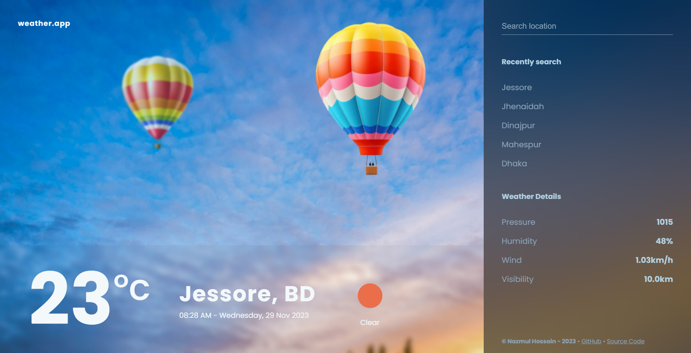
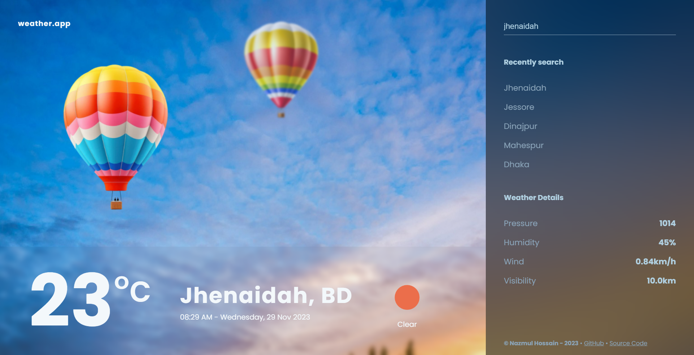
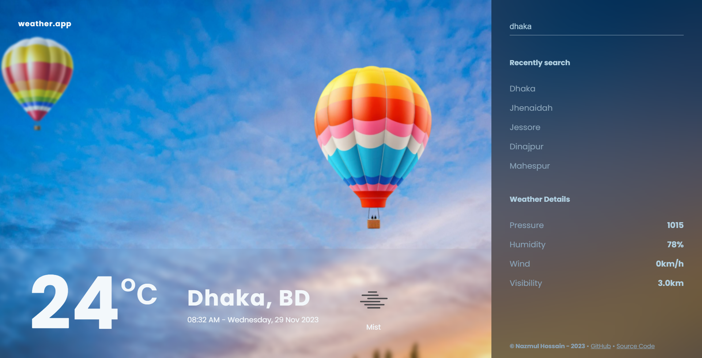

# Weather App ☁️🌡️

A clean and responsive **Weather App** built with **HTML, CSS, and Vanilla JavaScript**. The application uses the **OpenWeather API** to fetch real-time weather information based on the user's current location or a searched city.

It displays important weather information such as temperature, weather condition, humidity, wind speed, atmospheric pressure, and visibility. The app also keeps track of recently searched locations using browser `localStorage`.

## 🚀 Live Demo

👉 **[Visit the Live Weather App](https://nazmulhossain2905.github.io/weather-app/)**

## 📸 Screenshots

<table>
  <tr>
    <td width="50%">
      
    </td>
    <td width="50%">
      
    </td>
  </tr>
  <tr>
    <td width="50%">
      
    </td>
    <td width="50%">
      <!-- Additional screenshot can be added here -->
    </td>
  </tr>
</table>

## ✨ Features

* 🌤️ Display current weather information
* 📍 Automatically detect the user's location using browser geolocation
* 🔎 Search weather by city name
* 🌡️ Display current temperature in Celsius
* ☀️ Display weather condition and weather icon
* 💧 Display humidity
* 💨 Display wind speed
* 🌡️ Display atmospheric pressure
* 👁️ Display visibility
* 🕐 Display current local date and time
* 🕘 Keep a list of recently searched locations
* 💾 Store recent searches using browser `localStorage`
* 🔄 Automatically update the displayed time
* ⚠️ Handle invalid/non-existent city searches
* 📱 Responsive user interface
* 🎨 Custom weather-themed visual design
* 🎈 Animated balloon illustrations

## 🛠️ Tech Stack

### Frontend

* **HTML5** — Structure and semantic markup
* **CSS3** — Styling, responsive layout, animations, and visual design
* **JavaScript (ES6+)** — Application logic, DOM manipulation, API requests, and browser APIs

### APIs & Browser APIs

* **OpenWeather API** — Real-time weather data
* **Geolocation API** — Detect the user's current coordinates
* **Fetch API** — Retrieve weather data from OpenWeather
* **Web Storage API (`localStorage`)** — Store recently searched locations

The project is implemented without React, Vue, Angular, or another frontend framework.

## 📦 Dependencies

This is a lightweight frontend project and does **not** use npm or a `package.json` file.

There are no required npm packages or JavaScript frameworks.

The project uses the following external resources:

| Resource               | Purpose                   |
| ---------------------- | ------------------------- |
| OpenWeather API        | Fetch weather information |
| Google Fonts — Poppins | Application typography    |
| OpenWeather Icons      | Weather condition icons   |

The Poppins font is imported directly from Google Fonts in the stylesheet, while weather icons are loaded from OpenWeather.

## 📋 Prerequisites

Before running the project locally, make sure you have:

* A modern web browser such as Chrome, Firefox, Edge, or Safari
* Git
* An OpenWeather API key
* A local development server (recommended)

> **Note:** Browser geolocation generally works best when the application is served through `localhost` or HTTPS.

## ⚙️ Installation & Setup

### 1. Clone the repository

```bash
git clone https://github.com/NazmulHossain2905/weather-app.git
```

### 2. Navigate to the project directory

```bash
cd weather-app
```

### 3. Configure the OpenWeather API

The application retrieves weather data from the OpenWeather API.

For local development, create your own OpenWeather API key from the OpenWeather website.

**Recommended:** Do not commit your API key to a public GitHub repository.

The current project contains the API key directly inside:

```text
assets/app.js
```

A safer production architecture would move the API request behind a backend/serverless function so that the API key is not exposed to visitors.

### 4. Run the project

Because this is a static HTML/CSS/JavaScript project, you don't need to install dependencies.

You can simply open:

```text
index.html
```

in your browser.

For the best development experience, use a local server.

#### Using VS Code Live Server

1. Open the project folder in Visual Studio Code.
2. Install the **Live Server** extension.
3. Open `index.html`.
4. Right-click the file.
5. Select **Open with Live Server**.

The application should open at a local address such as:

```text
http://127.0.0.1:5500/
```

## 🌍 How It Works

When the application loads, it attempts to access the browser's geolocation information.

If permission is granted, the app sends the user's latitude and longitude to OpenWeather and displays the corresponding weather information.

If geolocation is unavailable or permission is denied, the application falls back to searching for **Dhaka**.

Users can also search for another city using the **Search Location** field.

The application then retrieves weather information including:

* City and country
* Temperature
* Weather condition
* Weather icon
* Humidity
* Wind speed
* Atmospheric pressure
* Visibility

## 🔎 Recently Searched Locations

The application stores recently searched cities in the browser's `localStorage`.

Up to five recent searches are maintained, and selecting a previously searched location allows the user to retrieve its weather information again.

## 📁 Project Structure

```text
weather-app/
│
├── assets/
│   ├── images/
│   │   ├── Weather-App.png
│   │   ├── Weather-App-2.png
│   │   ├── Weather-App-3.png
│   │   ├── balloon-1.png
│   │   ├── balloon-2.webp
│   │   ├── balloon-3.png
│   │   ├── balloon-4.png
│   │   ├── bg.jpg
│   │   ├── clear-sky.png
│   │   └── favicon.png
│   │
│   ├── app.js
│   └── style.css
│
├── index.html
└── README.md
```

The repository currently follows this simple static-project structure.

## 🔐 Environment Variables

### Current Project

No `.env` file or environment-variable system is currently configured in the repository.

The OpenWeather API key is currently defined directly in `assets/app.js`.

### Recommended Improvement

For a production application, avoid storing secrets directly in client-side JavaScript.

A recommended architecture would be:

```text
Frontend
   │
   ▼
Backend / Serverless Function
   │
   ▼
OpenWeather API
```

Then the API key can be stored as a server-side environment variable, for example:

```env
OPENWEATHER_API_KEY=your_api_key_here
```

> Never commit `.env` files containing private credentials to GitHub.

## 🔗 API

This project uses the **OpenWeather Current Weather Data API** to retrieve weather information.

The application requests weather data using either:

* City name
* Latitude and longitude

**OpenWeather API Documentation:**
https://openweathermap.org/current

**OpenWeather:**
https://openweathermap.org/

## 🔗 Useful Links

* 🌐 **[Live Demo](https://nazmulhossain2905.github.io/weather-app/)**
* 💻 **[GitHub Repository](https://github.com/NazmulHossain2905/weather-app)**
* 🌦️ **[OpenWeather](https://openweathermap.org/)**
* 📚 **[OpenWeather API Documentation](https://openweathermap.org/current)**
* 📍 **[MDN Geolocation API](https://developer.mozilla.org/en-US/docs/Web/API/Geolocation_API)**
* 💾 **[MDN Web Storage API](https://developer.mozilla.org/en-US/docs/Web/API/Web_Storage_API)**

## 🎯 Learning Objectives

This project demonstrates practical usage of several important frontend concepts:

* Working with REST APIs
* Using JavaScript `fetch()`
* Handling asynchronous operations with `async/await`
* Working with browser geolocation
* DOM manipulation
* Handling user input
* Managing data with `localStorage`
* Updating UI dynamically
* Working with external images and APIs
* Building responsive layouts with CSS

## 🚀 Future Improvements

Some potential improvements for future versions include:

* 🌍 Support for more detailed weather forecasts
* 📅 5-day or 7-day forecast
* 🌡️ Celsius/Fahrenheit unit switching
* 🌙 Dark mode
* ⭐ Favorite locations
* 🌧️ Dynamic backgrounds based on weather conditions
* 🌎 Interactive map integration
* 📊 More detailed weather statistics
* 🔐 Secure server-side API key handling
* ⏳ Loading indicators while fetching weather data
* 📡 Better API error handling and offline states

## 🤝 Contributing

Contributions and suggestions are welcome!

1. Fork the repository.
2. Create a new branch:

```bash
git checkout -b feature/your-feature
```

3. Make your changes.
4. Commit your changes:

```bash
git commit -m "Add your feature"
```

5. Push your branch:

```bash
git push origin feature/your-feature
```

6. Open a Pull Request.

## 👨‍💻 Author

**Nazmul Hossain**

* GitHub: https://github.com/NazmulHossain2905
* Repository: https://github.com/NazmulHossain2905/weather-app

## ⭐ Support

If you find this project useful or helpful for learning frontend development, consider giving the repository a ⭐ on GitHub.

---

**Built with ❤️ using HTML, CSS & Vanilla JavaScript.**
